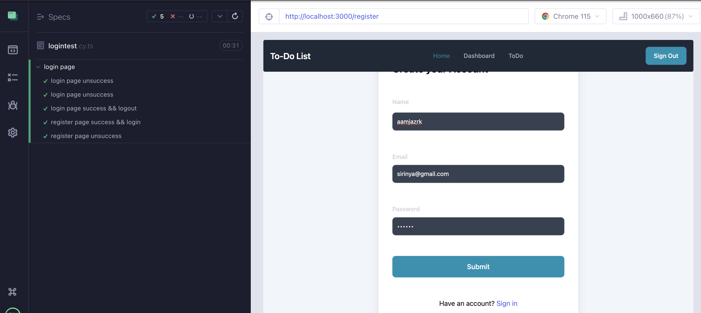
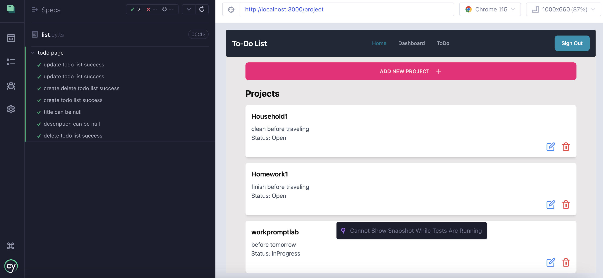
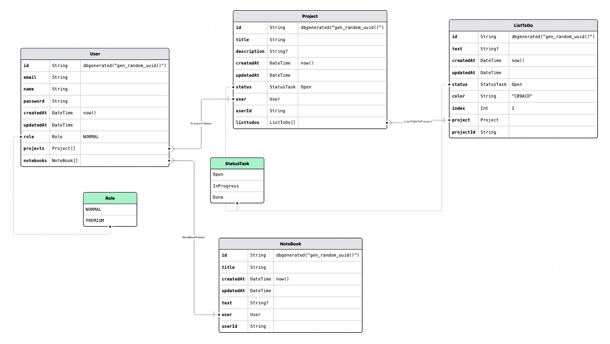

## How to run
- npm i 
- npm run build
- docker compose up --build

## Test
-  npx cypress open



## Login with
email : sirinya@gmail.com
password: zaq1@wsX

## Usefully URL
- www://localhost:5555 -> see database
- www://localhost:3000 -> see website


## Getting Started

This repo is about create To-Do List web app that using Next.JS, Docker, Postgresql, Prisma, Cypress.

## Database Design 

(https://prismaliser.app/)

## TECH STACK
- docker
- next js
- postgresql
- prisma
- cypress
- tailwind
- flowbite
- daisyUI

## Run Command
- Run docker
```bash
docker compose up -- build
docker compose down
```
- Run prisma
```bash
npx prisma studio
```
- build prisma sql
```bash
npx prisma migrate dev
```
- run seed
```bash
npx prisma db seed  
``` 

First, run the development server:

```bash
npm run dev
# or
yarn dev
# or
pnpm dev
```

Open [http://localhost:3000](http://localhost:3000) with your browser to see the result.

You can start editing the page by modifying `app/page.tsx`. The page auto-updates as you edit the file.

This project uses [`next/font`](https://nextjs.org/docs/basic-features/font-optimization) to automatically optimize and load Inter, a custom Google Font.

## Learn More

To learn more about Next.js, take a look at the following resources:

- [Next.js Documentation](https://nextjs.org/docs) - learn about Next.js features and API.
- [Learn Next.js](https://nextjs.org/learn) - an interactive Next.js tutorial.

You can check out [the Next.js GitHub repository](https://github.com/vercel/next.js/) - your feedback and contributions are welcome!

## Deploy on Vercel

The easiest way to deploy your Next.js app is to use the [Vercel Platform](https://vercel.com/new?utm_medium=default-template&filter=next.js&utm_source=create-next-app&utm_campaign=create-next-app-readme) from the creators of Next.js.

Check out our [Next.js deployment documentation](https://nextjs.org/docs/deployment) for more details.


